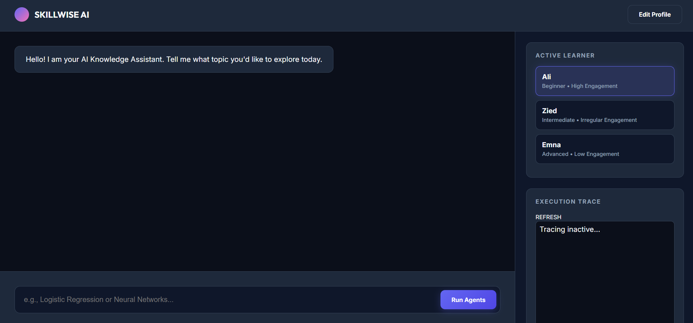
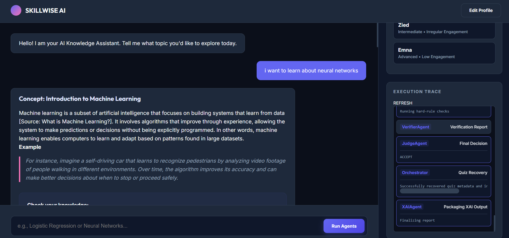
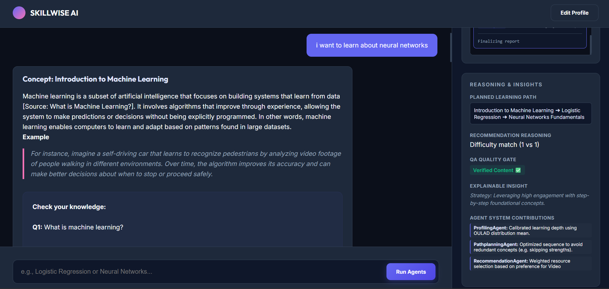

# 🧠 E-learning Multi-Agent Pipeline

> A modular multi-agent system for personalized learning, combining orchestration, retrieval, adaptive planning, and explainable AI.

---

## ✨ Overview

This project implements an **end-to-end intelligent learning pipeline** where multiple specialized agents collaborate to:

- understand learner intent (goal vs answer)
- build dynamic learner profiles
- plan personalized learning paths
- retrieve relevant educational content
- generate structured lessons and quizzes
- evaluate learner responses
- expose a full explainable execution trace

The system demonstrates how to design **robust, production-style AI pipelines** using a combination of:

- deterministic logic
- retrieval mechanisms
- and LLM-based generation

---

## 🏗️ Architecture (High-Level)

The system follows a **central orchestration pattern**:

```text
User Input
   ↓
Intent Detection
   ↓
Learner Profiling
   ↓
Path Planning
   ↓
Retrieval (RAG)
   ↓
Content Generation
   ↓
QA + Validation
   ↓
Quiz Grounding
   ↓
Response + XAI Trace
```
📌 Important:
A detailed technical breakdown (agents, flows, decisions, design tradeoffs) is available here:

👉 architecture_deep_dive.md

This README focuses on usage and system overview, while the deep dive explains how everything works internally.

## 🤖 Agents

| Agent | Responsibility |
|------|---------------|
| **ProfilingAgent** | Builds learner profile from history and signals |
| **PathPlanningAgent** | Selects next topic using a graph |
| **RecommendationAgent** | Retrieves and ranks resources |
| **ContentGeneratorAgent** | Generates lessons and quizzes via LLM |
| **VerifierAgent / JudgeAgent** | Validates generated output |
| **LearnerAgent** | Maintains learner state and answers |
| **XAIAgent** | Produces explainability trace |

---

## 📦 Project Structure

```text
├── src/
│   ├── agents/
│   ├── modules/
│   └── orchestrator.py
│
├── data/demo/
├── config/
├── web/
│
├── main.py
├── server.py
├── architecture_deep_dive.md
```
---

## 🖥️ Demo & Screenshots

🔹 Web Dashboard
Initial interface.


Shows learner interaction, generated content, system responses and a snippet of agents interaction and trace.


🔹 Explainability Trace
Shows the reasoning summary and insights of the agentic pipeline.



## ⚙️ Tech Stack
Python
FastAPI
Ollama (LLM runtime)
Pandas / NumPy / Scikit-learn
Lightweight RAG module
HTML / JS frontend

## 🚀 Features

### 🧠 Adaptive Learning
- Personalized progression based on learner profile  
- Topic graph navigation  

### 🔍 Retrieval-Augmented Generation
- Grounded content generation  
- Reduced hallucination risk  

### ✍️ Structured Generation
- Strict JSON outputs  
- Repair mechanisms for robustness  

### 🧪 Quiz Grounding
- Persistent quiz answers for reliable evaluation  

### 🔎 Explainability (XAI)
- Full pipeline trace available  
- Transparent decision-making  

### 🔄 Hybrid Intelligence
- Combines rules + LLM reasoning  
- Improves reliability vs pure LLM systems  

---

## 🚀 Getting Started

### 1. Clone the repository

```bash
git clone https://github.com/Zied-M/E-learning-MultiAgent-Pipeline.git
cd E-learning-MultiAgent-Pipeline
```
### 2. Setup environment

```bash
python -m venv venv
source venv/bin/activate   # Windows: venv\Scripts\activate
pip install -r requirements.txt
```

### 3. Run web application

```bash
python server.py
```
Open:
```text
http://localhost:8000
```
## 📊 Outputs

- `output.json` → structured pipeline result  
- `trace.log` → full execution trace  

Useful for debugging, analysis, and explainability.

---

## 🧩 Design Highlights

This project demonstrates:

- multi-agent orchestration  
- structured LLM pipelines  
- retrieval before generation  
- hybrid decision systems  
- stateful user modeling  
- explainable AI workflows  

---

## ⚠️ Limitations

- depends on local LLM (Ollama)  
- demo dataset only  
- minimal API validation  

---

## 🔮 Future Improvements

- vector search (FAISS / Chroma)  
- better evaluation metrics  
- Docker deployment  
- agent parallelization  

---

## 📚 Use Cases

- AI tutoring systems  
- adaptive education platforms  
- multi-agent AI research  
- explainable AI systems  
- LLM orchestration prototypes  

---

## ⭐ Final Note

This project focuses on **AI system design beyond just models**, emphasizing:

- orchestration  
- robustness  
- explainability  
- real-world usability  
