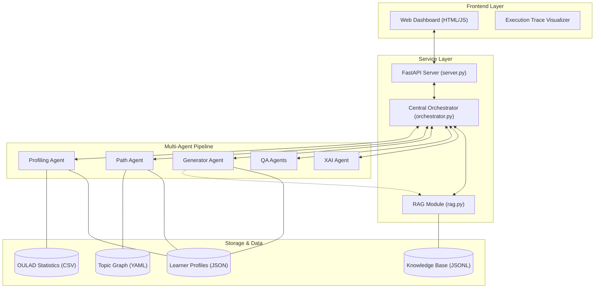
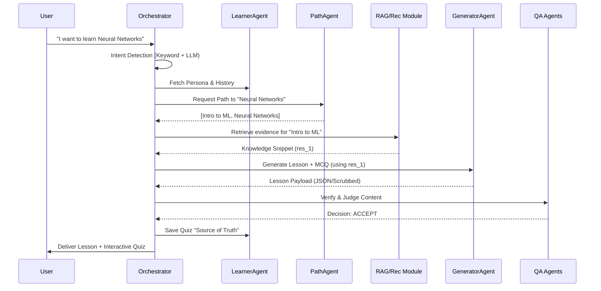
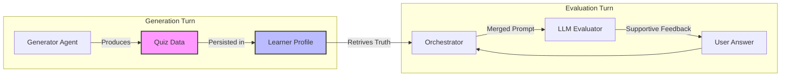

# Technical Deep Dive: Skillwise Multi-Agent Implementation

---

## 📖 Technical Jargon Decoder (The "Human" Translation)

Before we look at the code, here is what these complex terms actually mean in plain English:

- **Orchestrator**: Think of this as the **Conductor** of an orchestra. It doesn't play an instrument itself, but it tells every other agent when to start and stop so they work together.
- **Shared State**: Think of this as a **Shared Notebook**. When one agent learns something (like your name or your level), it writes it in the notebook so the next agent can read it without asking you again.
- **Prompt Inflation**: This is like **"Information Overload"** for the AI. If we give the AI too much history at once, it gets confused. We "inflate" the prompt only with what it needs at that exact second to keep it fast and smart.
- **Regex (Regular Expressions)**: A high-speed **"Pattern Finder"**. We use it to find things in messy text, like stripping away weird characters or finding the "1.2.3" in your answers.
- **JSON**: A specific **"Language for Data"**. It looks like text with braces `{}` and quotes `""`. Computers love it because it’s very organized, but humans sometimes find it messy.
- **Grounding (Source of Truth)**: This is the **"Cheat Sheet"**. Instead of letting the AI guess the right answer (and potentially hallucinate), we give it a "Source of Truth" (the correct keys) so it can never be wrong about the facts.
- **RAG (Retrieval-Augmented Generation)**: This is like an **"Open Book Exam"**. Instead of the AI relying only on its memory, it "Retrieves" relevant keyword matches from our database first and then uses that to explain a topic to you.
- **XAI (Explainable AI)**: This is the AI **"Showing its Work."** It doesn't just give you a recommendation; it tells you *why* it did it (e.g., "I chose this video because you said you are a Beginner").
- **Pandas**: A Python tool that works like **"Excel on Steroids"**. It’s how we process the big OULAD database to find student averages.
- **Mapping**: Think of this as a **"Translator Desk."** It’s how the system connects different ideas, like turning a learner’s button click into a specific answer text so the grader can understand it.

---

## 1. Orchestration: The State-Machine Pattern
The `Orchestrator` class in `src/orchestrator.py` acts as a central transaction coordinator.

### 🛠️ Technical Choice: Shared State Context
We use a `self.shared_state` dictionary to aggregate data as it flows through the agents.
- **Why?** This prevents "Prompt Inflation." Instead of passing the entire learner history to every agent, we pass only the relevant slice (e.g., `profile` to the Navigator, `resource` to the Generator).
- **Execution Strategy**: The `run()` method---

## 🏗️ 1. High-Level System Architecture

This diagram shows how the user interacts with the system through the Web Dashboard and how the Orchestrator manages the internal components.



---

## 🔄 2. Multi-Agent Sequential Flow

This flow illustrates the step-by-step logic the system follows once it detects a **GOAL** intent (requesting a new lesson).



---

## 📊 3. Data Dependency & "Source of Truth"

How the system ensures accuracy by grounding its evaluation in saved metadata.



---

## 🧠 4. Interactive Execution Loop
python
    if any(t['name'].lower() in input_lower for t in topics):
        if not any(str(i) in input_text for i in range(1, 6)):
            intent = "GOAL"
    ```
    - **Logic**: If the user mentions a topic (e.g., "Neural Networks") and doesn't include question numbers (1, 2, 3), the system *vetoes* the LLM's classification and forces **GOAL mode**. This fixed the issue where asking for a lesson was mistaken for a failing quiz response.

---

## 2. Intent Detection: The "Hybrid Veto" System
Intent detection is often the weakest point in LLM pipelines. We implemented a three-tier detector:

1.  **Keyword Catch**: Hard-coded lists like `goal_keywords` (learn, teach, explain) provide zero-latency detection for common commands.
2.  **LLM Classification**: A strict `Ollama` prompt identifies ambiguous inputs.
3.  **The State Veto**: 
    ```python
    if any(t['name'].lower() in input_lower for t in topics):
        if not any(str(i) in input_text for i in range(1, 6)):
            intent = "GOAL"
    ```
    - **Logic**: If the user mentions a topic (e.g., "Neural Networks") and doesn't include question numbers (1, 2, 3), the system *vetoes* the LLM's classification and forces **GOAL mode**. This fixed the issue where asking for a lesson was mistaken for a failing quiz response.

---

## 3. Data Science Integration: OULAD Calibration
The `ProfilingAgent` doesn't just guess levels; it uses the **Open University Learning Analytics Dataset (OULAD)**.

- **The Logic**: 
  - We load `studentAssessment.csv` using **Pandas**.
  - We calculate the 25th, 50th, and 75th percentiles of all historic scores.
  - **The Math**: `mean_score = df['score'].mean()`.
  - **Application**: If a learner's synthetic performance is in the 75th percentile, the system sets `pace: "Fast"` and increases the Generator's complexity target. This ensures the recommendation is grounded in real-world educational data distributions.

---

## 4. Robustness: The JSON Shield & Repair Logic
LLMs frequently include conversational "noise" in their JSON outputs.

### 🔧 ContentGeneratorAgent Extraction
Located in `src/agents/generator_agent.py`, the `generate_content` method uses an aggressive extraction strategy:
- **String Indexing**: Uses `.find('{')` and `.rfind('}')` to ignore any text before or after the JSON payload.
- **Auto-Repair**:
  ```python
  fixed = re.sub(r"\'(\w+)\'\s*:", r'"\1":', json_part) # Fixes single-quoted keys
  fixed = fixed.replace(",\n}", "\n}") # Removes trailing commas
  ```
- **Fallback Regex**: If `json.loads` still fails, the system invokes the `_hunt_for_quiz` helper.

### 🧼 The "Deep Clean" Scrubber
The `_hunt_for_quiz` helper in the Orchestrator uses recursive regex to find Question/Answer blocks even if the LLM forgot the braces. It then applies a **Debris Filter** that strips technical syntax like `":`, `\n`, and `{\}` from the labels.

---

## 5. The "Source of Truth" Evaluation Model
The grading isn't just an LLM guessing if you're right. 

1.  **Grounding**: When the lesson is generated, the *Generator Agent's* answers are persisted in `learner_profiles.json`.
2.  **Truth Mapping**: The `Orchestrator` builds a "Truth Context" by mapping every question to its saved answer and full option list.
3.  **The Review Loop**: The `eval_prompt` instructs the LLM to act as a supportive tutor. It compares the user's string against the "Truth Map" and reveals the correct answers immediately.
4.  **Auto-Progression Logic**:
    ```python
    self.learner_agent.add_learned_topic(learner_id, last_topic)
    # Marks as mastered regardless of score to ensure flow
    ```

---

## 6. Frontend: Interactive Execution Trace
The Dashboard (`web/app.js`) implements a pattern for **Explainable AI (XAI)** visualization.

- **Parsing**: It reads the `trace.log` file, which follows a consistent `[AgentName] ActionName: Detail` format.
- **Regex Mapping**: The UI uses simple regex to split these logs into clickable "Trace Steps."
- **Visual Feedback**: The `handlePipelineResult` function detects failure markers (e.g., "NOT QUITE") and dynamically switches CSS classes from `.praise-tag` (green) to `.fail-tag` (red/neutral), providing instant visual context to the learner.

---

*This technical architecture prioritizes **state consistency** and **error recovery**, ensuring that the multi-agent system remains stable even when the underlying LLM's output format fluctuates.*
